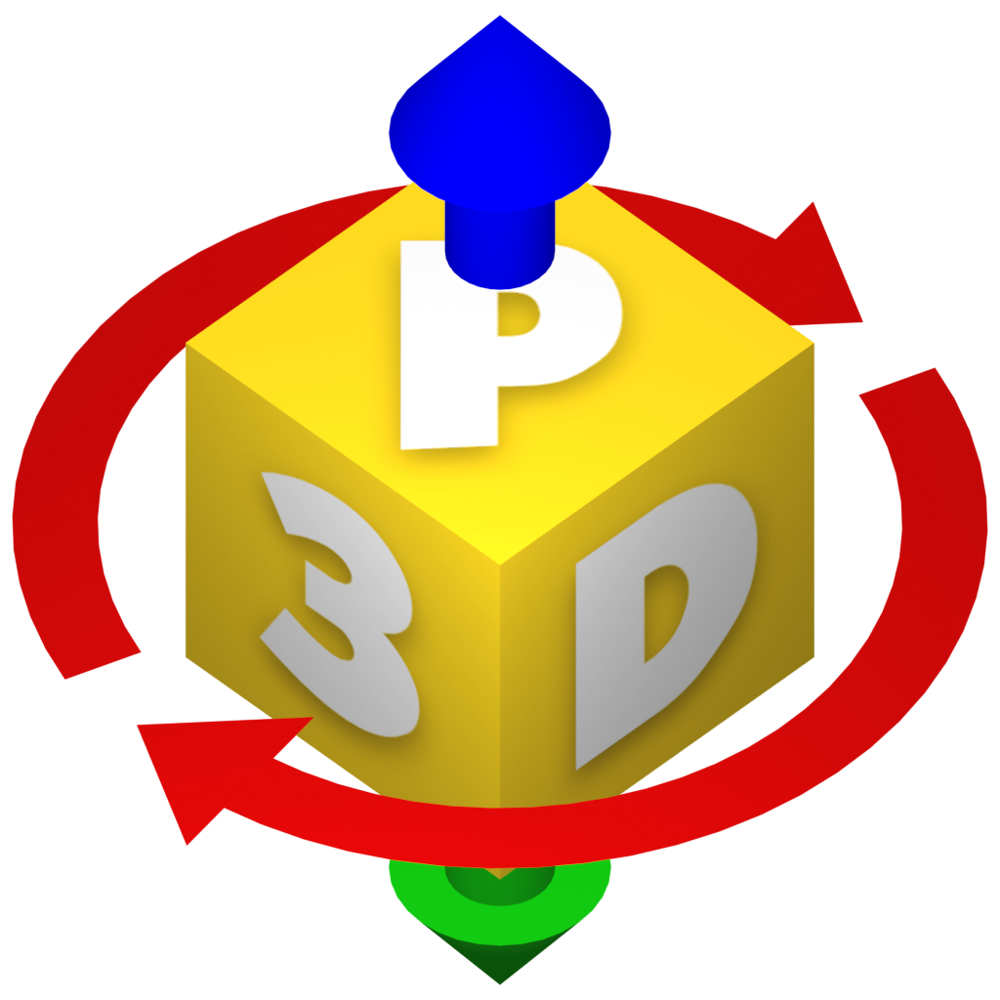
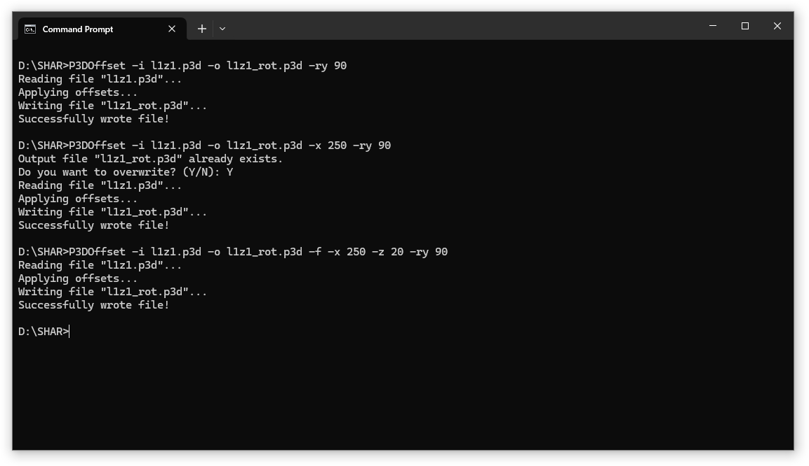

	

<h1 align="center">
	P3DOffset
</h1>

*P3DOffset* is a command-line tool for applying translations and rotations to Pure3D chunks used in *The Simpsons: Hit & Run*. It is primarily intended for offsetting world objects and their respective chunks, such as static meshes (e.g. `Static Entity` chunks), collision (e.g. `Static Phys` and `Fence` chunks) animated meshes (e.g. `Anim` and `Anim Coll` chunks), physics objects (e.g. `Dyna Phys` chunks), and other miscellaneous things (`Locator` chunks, `Road` chunks, etc.).

In addition, it also supports offsetting drawables (e.g. `Composite Drawable` and `Scenegraph` chunks) that are used by things such as vehicles, gags, and frontend models.

## Download

Compiled builds for Windows and Linux can be found on the [Releases page](https://github.com/ColouMods/P3DOffset/releases). You will need [.NET 8.0](https://dotnet.microsoft.com/en-us/download/dotnet/8.0) to run them.

## Usage

	

*P3DOffset* is run from the command-line, and a number of arguments are used to configure it:

<table align="center" >
	<tr>
		<th width="200">Argument</th>
		<th width="500">Function</th>
	</tr>
	<tr>
		<td><b>-h, --help</b></td>
		<td>Display help message.</td>
	</tr>
	<tr>
		<td><b>-i, --input</b></td>
		<td>Set path to the input file. <b>Required</b>.</td>
	</tr>
	<tr>
		<td><b>-o, --output</b></td>
		<td>Set path to the output file. <b>Required</b>.</td>
	</tr>
	<tr>
		<td><b>-f, --force</b></td>
		<td>Force overwrite the output file.</td>
	</tr>
	<tr>
		<td><b>-x</b></td>
		<td>Set X position offset.</td>
	</tr>
	<tr>
		<td><b>-y</b></td>
		<td>Set Y position offset.</td>
	</tr>
	<tr>
		<td><b>-z</b></td>
		<td>Set Z position offset.</td>
	</tr>
	<tr>
		<td><b>-rx</b></td>
		<td>Set X rotation offset.</td>
	</tr>
	<tr>
		<td><b>-ry</b></td>
		<td>Set Y rotation offset.</td>
	</tr>
	<tr>
		<td><b>-rz</b></td>
		<td>Set Z rotation offset.</td>
	</tr>
	<tr>
		<td><b>-ro, --order</b></td>
		<td>Set order of rotations. Defaults to 'ZYX'</td>
	</tr>
</table> 

## Important notes

- Currently, this tool does not support offsetting `Intersect` collision chunks due to their relative complexity compared to other chunk types. Each `Intersect` chunk need to be aligned with the bounds of the game's [k-d Tree](https://en.wikipedia.org/wiki/K-d_tree) and so they cannot be simply offset - every chunk needs to be re-generated from scratch. This may be supported in future, but for the moment I recommend using the Pure3D editor's 'Export All Intersect' and 'Import All Intersect' functions to offset the collision manually.

- This tool, like the game, uses a left-handed coordinate system with Y as the up axis. This is different from many 3D modelling programs (such as Blender) which use a right-handed coordinate system with Z as the up axis. As such, you may need to swap around translation or rotation values if you are taking them from these programs.